# DAY 1: 24 Oktober 2022

# Web Server dan RESTful API

## Server

### Apa itu server ?

Web server merupakan tempat yang digunakan untuk menampung codingan Back-End maupun Front-End.
Server sendiri terdiri dari dua bagian, yaitu :

1. Hardware
2. Software

Terdapat sebuah analogi yang menggambarkan hubungan antara Front-End, Back-End dan Server
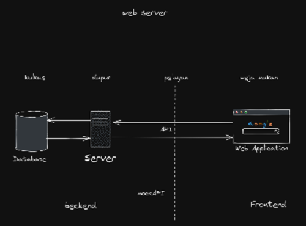

Web application akan melakukan request ke server melalui API, kemudian request tersebut akan diproses oleh oleh server, data yang dibutuhkan ketika request diproses akan diambil dari database, setelah request selesai diproses data tersebut akan dikembalikan ke web application. Pada API sendiri dapat diberikan sistem keamanan supaya tidak semua orang dapat mengakses informasi yang tersimpan di dalam database.

### Arsitektur Web Service


Kelebihan menggunakan arsitektur Front-End dan Back-End terpisah dibanding dengan arsitektur monolith:
1. Apabila salah satu fitur atau fungsi pada monolith rusak maka seluruh sitem tidak dapat digunakan. Berbeda dengan arsitektur terpisah apabila salah satu fitur atau fungsi bermasalah, maka sistem akan tetap berjalan
2. Pada arsitektur terpisah, satu sistem Back-End dapat digunakan diberbagai aplikasi seperti aplikasi dekstop, mobile, web, dll 
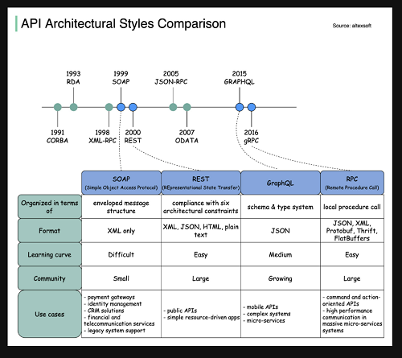
Pada web architecture di atas, kita akan mempelajari front-end & back-end serta REST.

## REST

### Pengertian REST

REpresentational State Transfer, salah satu arsitektur design yang digunakan untuk membuat web service. Format data yang dikirim dapat dalam bentuk XML, JSON, HTML, dan Plain Text.

### Aturan yang ada pada REST

1. Uniform interface, bentuk masing-masing API seragam untuk memudahkan orang-orang mempelajari atau membaca fungsi pada API
2. client-server, memiliki client dan server
3. stateless, tidak bergantung pada data yang dimiliki oleh user
4. cacheable, dapat dipasangkan pada sistem casing(?) manapun
5. Layered System
6. Code on demand (optional)

API yang menerapkan aturan arsitektur di atas disebut [**RESTful API**](https://restfulapi.net/)

RESTful API akan berjalan pada HTTP, HTTP sendiri memiliki beberapa [method](https://restfulapi.net/http-methods/) :

1. GET, digunakan untuk mengambil data dari API
2. POST, digunakan untuk mengirim data user ke API
3. DELETE, digunakan untuk menghapus data
4. PUT, digunakan untuk meng-Update data keseluruhan
5. PATCH, digunakan untuk meng-Update data sebagian. Namun penggunaan patch tidak disaranan karena tidak bersifat Universal

Bagimana membentuk alamat API yang bagus :

1. Gunakan sebuah nama benda, contoh `/user`
2. Gunakan _kebab-case_ untuk nama yang memiliki lebih dari satu suku kata, contoh `.user-device/`
3. Gunakan **lowercase**, jangan camelCase
   
   untuk mendapatkan satu data saja tambahkan id dibelakang alamat.

Pada proses transfer data terdapat [status code](https://restfulapi.net/http-status-codes/):

1. 2xx - success
2. 3xx - redirect
3. 4xx - client error, kesalahan yang terjadi pada pengguna
4. 5xx - server error, kesalahan yang terjadi pada server

# DAY 2: 25 Oktober 2022

# Node JS

Merupakan javaScript runtime yang dibangun di atas javaScript engine yang bernama _V8_. Runtime sendiri adalah sebuah tempat untuk mengeksekuis code yang kita buat. **Node Js** dibuat pada tahun 2009 oleh Ryan Dahl, Ryan Dahl ingin membuat sebuah web server yang menggunakan event loop, web server tersebut sudah pernah dicoba menggunakan bahasa pemrograman C, Lua, dan Haskell namun masih menemukan banyak problem. Akhirnya Ryan Dahl mencoba menggunakan V8 dan berhasil.

Fitur utama yang ada pada Node Js :

1. File system
2. Http dan Https
3. REPL (Read, Eval, Print, Loop)
4. Console

## [Install](https://nodejs.org/en/) node js

1. Ketik node-v untuk mengetahui apakah installasi berhasil atau tidak
2. Ketik npm-v untuk mengecek NPM yang sudah disediakan oleh NodeJs
3. Untuk melakukan running, ketik `node namaFile` pada terminal direktori file js nya

## Build in Module pada Node Js

1. **console**
   Sama seperti javaScript, node js memiliki module bawaan untuk menampilkan debug atau code secara interface

   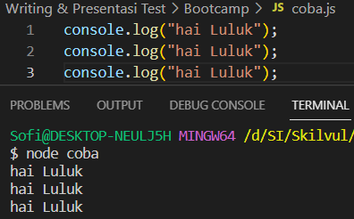

2. **process**
   digunakan untuk mengontrol dan menampilkan proses yang sedang dijalankan

   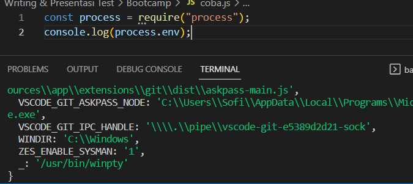

3. **os**
   digunakan untuk menampilkan informasi terkait sistem operasi komputer yang digunakan user

   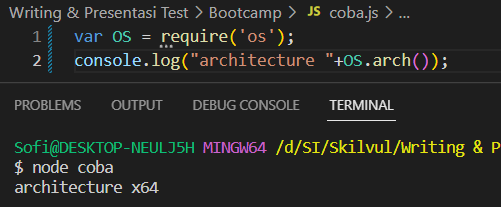

4. **util**
   alat bantu yang mendukung kebutuhan internal API di Node Js

   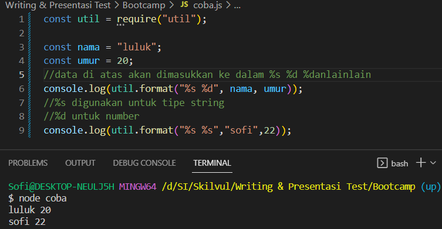

5. **events**

   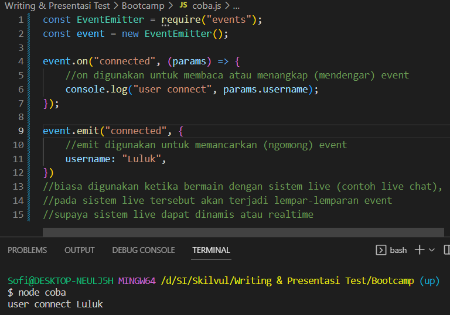

   Callback dengan event memang hampir sama, bedanya callback dikerjakan setelah fungsi tak sinkron memberikan nilai kembalian, sedangkan event dikerjakan dengan menggunakan pendekatan observer. Observer disini adalah fungsi yang dimanfaatkan sebagai pendeteksi ketika terjadi suatu event. Gunakan `method on(nama_event, fungsi observer)` untuk menambahkan observer sebagai detektor event.

6. **HTTP**
   built-in module tersebut memungkinakn node js mentransfer data melalui Hyper Text Transfer Protocol (HTTP) sehingga server HTTP dapat mendengarkan port server dan memberikan respons kembali ke klien.
   rules :

   - gunakan `require()`
   - gunakan method `createServer()` untuk membuat server HTTP
   - Callback function yang digunakan pada method `http.createServer()`, akan dijalankan ketika seseorang mencoba mengakses komputer pada port 8080.

   ```javascript
   const http = require("http");

   http
     .createServer((req, res) => {
       //createServer merupakan callback function,
       //yang isinya requestlistener(request dan respon)
       //req merupakan nama parameter dari request dan res untuk respon
       res.write("Hai");
       res.end();
       //res.end digunakan untuk memberi tanda bahwa respon sudah selesai
     })
     .listen(8080, () => {
       console.log("Server running at http://localhost:8080");
       //untuk menentukan port mana yang akan digunakan
       //port harus dicek apakah sudah dipakai atau belum, supaya tidak terjadi conflict
       //cek port https://en.wikipedia.org/wiki/List_of_TCP_and_UDP_port_numbers
     });
   //.listen digunakan untuk mengaktifkan apa yang kita buat
   ```

   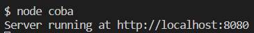

   apabila alamat http://localhost:8080 diklik, maka akan muncul tampilan seperti dibawah ini

   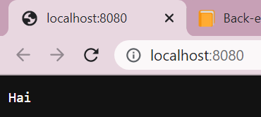

   **HTTP Header**

   - gunakan method `res.writeHead()` untuk menambahkan header HTTP
   - Argumen pertama dari method res.writeHead() adalah status code
   - Argumen kedua adalah objek yang berisi header respons.
   - Respons yang dikembalikan dari HTTP web server bisa dalam berbagai format (JSON, HTML, XML, CSV, zip, audio, video, PDF ,dan lain-lain)

   ```javascript
   const http = require("http");

   http
     .createServer((req, res) => {
       res.writeHead(200, { "Content-Type": "text/html" });
       res.write("Hai");
       res.end();
     })
     .listen(8080, () => {
       console.log("Server running at http://localhost:8080");
     });
   ```

   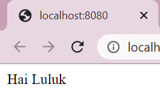

   **Membaca query string**

   - Callback function pada method http.createServer() memiliki argumen req yang mewakili request dari klien, sebagai objek (objek http.IncomingMessage).
   - Objek ini memiliki sebuah properti yang disebut "url" yang menyimpan informasi url yang sedang mengakses.

   ```javascript
   const http = require("http");

   http
     .createServer((req, res) => {
       res.writeHead(200, { "Content-Type": "text/html" });
       res.write(req.url);
       res.end();
     })
     .listen(8080, () => {
       console.log("Server running at http://localhost:8080");
     });
   ```

   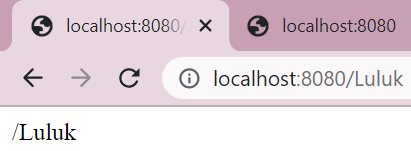

   apabila alamat yang diketik adalah http://localhost:8080/sofi , maka yang ditampilkan di browser adalah sofi

# DAY 3: 26 Oktober 2022

# [Express JS](https://www.npmjs.com/package/express)

Merupakan framework yang digunakan untuk membuat web server yang membantu pengelolaan aliran data dari server ke aplikasi, dibangun di atas node js dan bersifat open source.

## Basic syntax

```javascript
const express = require("express"); //panggil express
const app = express();
app.get("/", (req, res) => {
  //route
  res.send("hai luluk");
});
app.listen(7000); //listen
```

## Basic route

Merupakan sebuah end point yang dapat diakses menggunakan URL website.

```javascript
app.get("/", (req, res) => {
  res.send("hai luluk");
});
```

- `.get` merupakan method API
- `'/'` merupakan alamat
- `res.send("hai luluk")` merupakan response

aplikasi di atas akan berjalan di alamat `http://localhost:7000` , 7000 diambil dari app.listen(7000)

## [Response](http://expressjs.com/en/api.html#res)

contoh response pada program di atas adalah res.send, selain itu kita dapat mengirim response dalam bentuk json suapay data yang dikirim mudah di akses

## [Status code](https://developer.mozilla.org/en-US/docs/Web/HTTP/Status)

Status code berfungsi sebagai informasi apakah route yang kita akses berjalan sebagaimana mestinya dan tidak terjadi error.

## Nested route

Digunakan ketika terdapat banyak route yang memiliki nama yang sama atau ingin membuat route yang lebih mendalam

## Query

Merupakan parameter yang digunakan untuk membantu menentukan tindakan yang lebih spesifik daripada hanya sekedar router biasa, query biasa ditaruh diakhir route dengan diawali `?` yang dilanutkan dengan key dan data yang diinginkan

## Membuat express nodejs

Untuk menggunakan express kita harus menginstallnya dengan mengetikkan `npm install express`, hasilnya akan terlihat seperti contoh di bawah ini :

```html
$ npm i express added 57 packages, and audited 58 packages in 12s 7 packages are
looking for funding run `npm fund` for details found 0 vulnerabilities
```

setelah berhasil menginstall express maka akan ada beberapa file baru pada direktorinya.

Kemudian terdapat sebuah module yang digunakan untuk mempermudah develop server side application agar dapat merestart application secara otomatis selama proses development

cara installnya cukup ketikkan `npm install --save-dev nodemon` pada terminal direktori, kemudian akan muncul teks seperti di bawah ini

```html
added 32 packages, and audited 90 packages in 24s 10 packages are looking for
funding run `npm fund` for details found 0 vulnerabilities
```

kemudian install nodemon secara global untuk mempermudah penggunaannya

```html
$ npm i -g nodemon added 32 packages, and audited 33 packages in 6s 3 packages
are looking for funding run `npm fund` for details found 0 vulnerabilities
```

cara menggunakan nodemon dalah `nodemon namaApp`

```javascript
const express = require("express"); //panggil express
const app = express(); //digunakan untuk membuat aplikasi express ke dalam variabel app

app.get("/movies", (req, res) => {
  // .get selain menerima path:/movies, juga menerima handler berupa callback dengan maksimal 3 parameter
  res.send("hai");
  //digunakan untuk mengirim plain text ketika kita mengakses route tersebut.
});

app.get("/biodata", (req, res) => {
  res.send([
    {
      nama: "Luluk",
      tempat: "Magelang",
      tanggal: "20 Juli 2002",
    },
  ]);
});

app.listen(7000);
```

hasil pemanggilan localhost menggunakan endpoint /movies

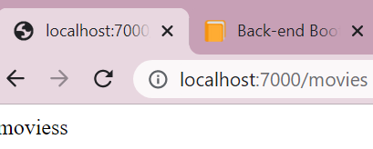

hasil pemanggilan localhost menggunakan endpoint /biodata

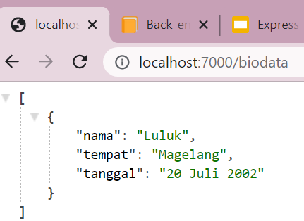

## Middleware pada express

Middleware merupakan function yang menjadi penyaring, penengah, yang memiliki akses ke object request, response dan sebuah fungsi next didalam request-response cycle. Contoh kerja middleware adalah pada fitur login, middleware akan menyaring apakah password sudah sesuai atau belum untuk bisa dikelola di controller.

### Yang dapat dilakukan oleh middleware

1. Menjalankan kode apapun.
2. Memodifikasi Object Request dan Object Response.
3. Menghentikan request-response cycle.
4. Melanjutkan ke middleware function selanjutnya atau ke handler function dalam suatu request response cycle.

### Jenis Express Middleware Berdasarkan Cara Penggunaan

1. Application Level Middleware

- Application Level Middleware adalah sebuh function middleware yang melekat ke instance object Application Express.
- Penggunaannya dengan cara memanggil method `app.use()`.
- Application Level Middleware akan di jalankan setiap kali Express Application menerima sebuah HTTP Request.

2. Router Level Middleware

- Router Level Middleware adalah sebuh function middleware yang cara kerjanya sama persis dengan application level middleware, yang menjadikan perbedaan adalah middleware function ini melekat ke instance object Router Express
- Penggunaannya dengan cara memanggil method `express.Router()`.
- Router Level Middleware hanya akan di jalankan setiap kali sebuah Express Router yang menggunakan middleware ini menerima sebuah HTTP Request, sedangan pada Router yang lain tidak akan dijalankan.

3. Error Handling Middleware

- Error Handling mengacu kepada bagaimana cara sebuah Express Application menangkap dan memproses error yang terjadi, baik itu berupa kesalahan yang synchronous maupun asynchronous.
- Error handle function default milik Express Application hanyalah kerangka functionnya saja, kita tetap harus menuliskan di dalam function ini bagaimana sebuah error akan di handle.

```javascript
const express = require("express"); //panggil express
const app = express();

const errorHandling = function (err, req, res, next) {
  console.error(err.stack);
  res.status(500).send("something broke");
};
```

## Jenis Express Middleware Berdasarkan Source Middleware Function

1. Express Build-in Middleware

- `express.static()`, memungkinkan sebuah express application melayani asset statis berupa file, seperti file HTML, gambar, video, dokumen, dan sebagainya.
- `express.json()`, memungkinkan sebuah express application menerima HTTP Request yang membawa payload (data) dalam format JSON.
- `express.urlEncoded()`, memungkinkan sebuah express application menerima HTTP Request yang membawa payload (data) dalam format urlencoded.

2. Third Party (custom) Middleware
   Menggunakan third party middleware function dapat menambahkan fungsionalitas dari sebuah Express Application.

```javascript
const express = require("express"); //panggil express
const app = express(); //digunakan untuk membuat aplikasi express ke dalam variabel app

app.use(express.json());
//.json digunakan untuk parsing request ke json ketika melakukan post
//app.use digunakan untuk menggunakan function middleware

const biodata = [
  {
    nama: "Luluk",
    tempat: "Magelang",
    tanggal: "20 Juli 2002",
  },
];

app.get("/biodata", (req, res) => {
  res.send(biodata);
});

app.post("/biodata", (req, res) => {
  //post digunakan untuk menerima inputan user dr request
  //untuk menggunakan post diperlukan adanya middleware
  const data = req.body;
  biodata.push(data);
  //digunakan untuk menambahkan data respone yang di request oleh user
  res.send("oke");
  //menampilkan data yang dikirim oleh user ke dalam terminal
  res.status(201);
  //digunakan untuk memberi status code
});

app.listen(7000);
```

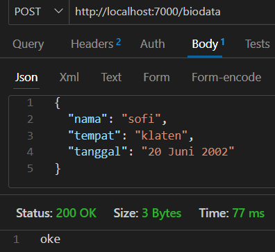

ketika menambahka data berhasil, maka akan menampilkan reponse oke.

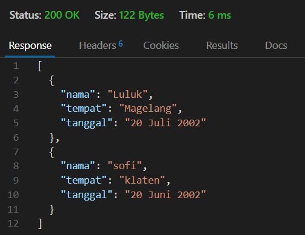

data di atas merupakan data terbaru setelah user melakukan request tambah data pada post.

# DAY 4: 27 Oktober 2022

# Design Database

## Entity Relationship Model

Digunakan untuk mendesain database berdasar pelaku atau objek.
contoh case :

- user dapat mengikuti matakuliah

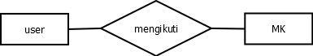

objek user dan matakuliah dihubungkan oleh relasi mengikuti, relasi digambarkan dengan belahketupat

- 1 dosen hanya bisa mengajar 1 matakuliah

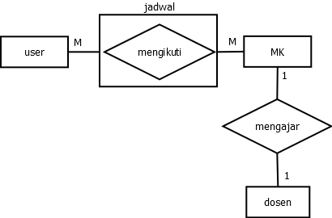

Setelah diteliti kembali, ternyata 1 user dapat mengambil banyak matakuliah, dan 1 matakuliah dapat diambil banyak user. Oleh sebab itu relasi antara user dan matakuliah adalah many to many. Karena relasinya many to many, maka relasi mengikuti akan menjadi sebuah entita baru bernama jadwal.

Setelah menentukan entity dan relasi, selanjutnya tentukan properti pada setiap entity.
contoh :

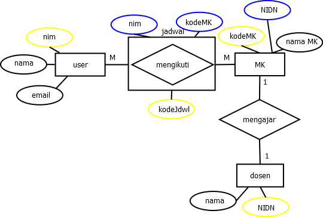

pada setiap entitas pasti memiliki satu properti yang unik dan tidak akan dimiliki oleh entitas lain, properti tersebut bernama primary key (lingkaran kuning).
kemudian terdapat foreign key yang merupakan sebuah atribut atau gabungan atribut yang terdapat dalam suatu tabel yang digunakan untuk menciptakan hubungan (relasi) antara dua tabel.

## Entity model diagram

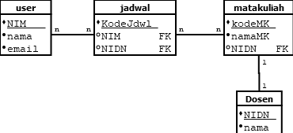

EMD dibuat setelah erd selesai dibuat, bertujuan untuk memudahkan pembacaan
