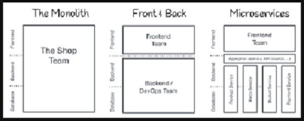

# DAY 1: 24 Oktober 2022

# Web Server dan RESTful API

## Server

### Apa itu server ?

Web server merupakan tempat yang digunakan untuk menampung codingan Back-End maupun Front-End.
Server sendiri terdiri dari dua bagian, yaitu :

1. Hardware
2. Software

Terdapat sebuah analogi yang menggambarkan hubungan antara Front-End, Back-End dan Server

Web application akan melakukan request ke server melalui API, kemudian request tersebut akan diproses oleh oleh server, data yang dibutuhkan ketika request diproses akan diambil dari database, setelah request selesai diproses data tersebut akan dikembalikan ke web application. Pada API sendiri dapat diberikan sistem keamanan supaya tidak semua orang dapat mengakses informasi yang tersimpan di dalam database.

### Arsitektur Web Service

Kelebihan menggunakan arsitektur Front-End dan Back-End terpisah dibanding dengan arsitektur monolith:
1. Apabila salah satu fitur atau fungsi pada monolith rusak maka seluruh sitem tidak dapat digunakan. Berbeda dengan arsitektur terpisah apabila salah satu fitur atau fungsi bermasalah, maka sistem akan tetap berjalan
2. Pada arsitektur terpisah, satu sistem Back-End dapat digunakan diberbagai aplikasi seperti aplikasi dekstop, mobile, web, dll 

Pada web architecture di atas, kita akan mempelajari front-end & back-end serta REST.

## REST

### Pengertian REST

REpresentational State Transfer, salah satu arsitektur design yang digunakan untuk membuat web service. Format data yang dikirim dapat dalam bentuk XML, JSON, HTML, dan Plain Text.

### Aturan yang ada pada REST

1. Uniform interface, bentuk masing-masing API seragam untuk memudahkan orang-orang mempelajari atau membaca fungsi pada API
2. client-server, memiliki client dan server
3. stateless, tidak bergantung pada data yang dimiliki oleh user
4. cacheable, dapat dipasangkan pada sistem casing(?) manapun
5. Layered System
6. Code on demand (optional)

API yang menerapkan aturan arsitektur di atas disebut [**RESTful API**](https://restfulapi.net/)

RESTful API akan berjalan pada HTTP, HTTP sendiri memiliki beberapa [method](https://restfulapi.net/http-methods/) :

1. GET, digunakan untuk mengambil data dari API
2. POST, digunakan untuk mengirim data user ke API
3. DELETE, digunakan untuk menghapus data
4. PUT, digunakan untuk meng-Update data keseluruhan
5. PATCH, digunakan untuk meng-Update data sebagian. Namun penggunaan patch tidak disaranan karena tidak bersifat Universal

Bagimana membentuk alamat API yang bagus :

1. Gunakan sebuah nama benda, contoh `/user`
2. Gunakan _kebab-case_ untuk nama yang memiliki lebih dari satu suku kata, contoh `.user-device/`
3. Gunakan **lowercase**, jangan camelCase
   
   untuk mendapatkan satu data saja tambahkan id dibelakang alamat.

Pada proses transfer data terdapat [status code](https://restfulapi.net/http-status-codes/):

1. 2xx - success
2. 3xx - redirect
3. 4xx - client error, kesalahan yang terjadi pada pengguna
4. 5xx - server error, kesalahan yang terjadi pada server

# DAY 1: 25 Oktober 2022

# Node JS

Merupakan javaScript runtime yang dibangun di atas javaScript engine yang bernama _V8_. Runtime sendiri adalah sebuah tempat untuk mengeksekuis code yang kita buat. **Node Js** dibuat pada tahun 2009 oleh Ryan Dahl, Ryan Dahl ingin membuat sebuah web server yang menggunakan event loop, web server tersebut sudah pernah dicoba menggunakan bahasa pemrograman C, Lua, dan Haskell namun masih menemukan banyak problem. Akhirnya Ryan Dahl mencoba menggunakan V8 dan berhasil.
Fitur utama yang ada pada Node Js :

1. File system
2. Http dan Https
3. REPL (Read, Eval, Print, Loop)
4. Console
